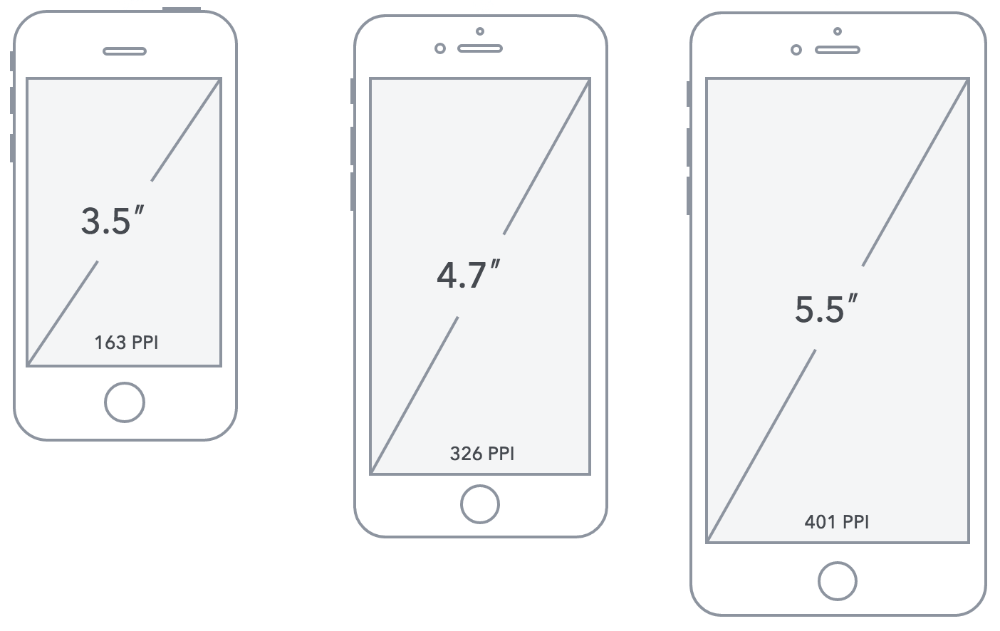
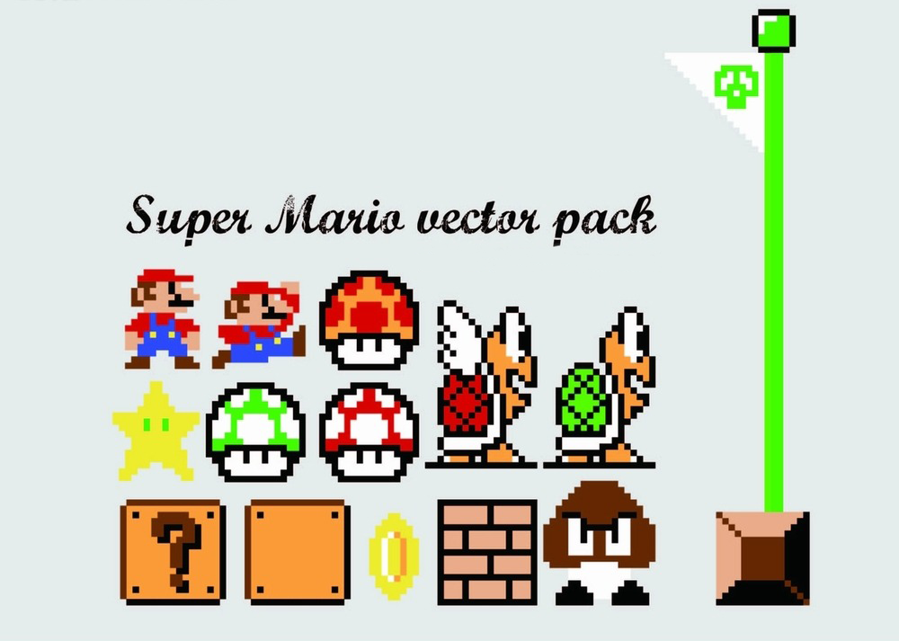
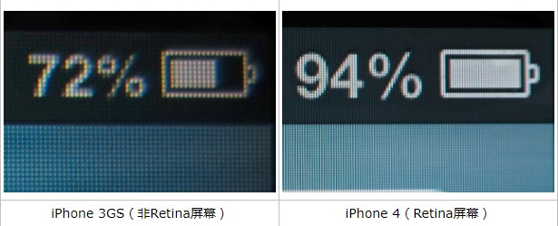
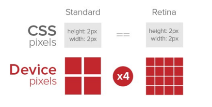

# 流式布局

# 移动端

## viewport

* 语法：HTML默认980px；**width=device-width：改变HTML默认的980px   为   屏幕的宽度；**

```
<meta name="viewport" content="width=device-width, user-scalable=no, initial-scale=1.0, maximum-scale=1.0, minimum-scale=1.0">
```

## 二倍图

### 手机尺寸

* 对角线长度，1英寸=2.53cm;



### 物理像素点

* 指计算机显示设备中的最小单位，即一个像素点的大小。每一个像素点可以理解为就是屏幕上的一个发光点。每个点可以发一个颜色，就是我们看到的画面。
* 一个萝卜一个坑



### 屏幕分辨率

* 屏幕分辨率：物理像素点的个数来衡量，表示屏幕水平和垂直方向的物理像素点的个数，”坑“有多少个；

* iPhone3和iPhone4是同一个屏幕尺寸下，比较分辨率：




* 坑会越做越小：直观感受，画面细腻；Retina（视网膜屏幕）是一种显示技术，可以将把更多的物理像素点压缩至一块屏幕里；从而达到更高的分辨率，并提高屏幕显示的细腻程度。
* ‘坑’特点：越做越小；（iPhone4坑的宽度是iPhone3坑的宽度一半）



### 图片分辨率

* 图片都是有颜色，图片分辨率。图片分辨率就是带着“萝卜”来的；

- 下图：分辨率640*426 ，提供了多少个色彩发光点（迎合物理像素点）；


* 到这，谁提供萝卜（图片），谁会提供坑（手机上物理像素点）；

* 假设：**有200*200分辨率**的图片，展示在宽度分别是320（iphone3）、640(iphone4)分辨率的手机上，展示的效果如下：

  

* 分析：
  * 200*200分辨率的图片：200个颜色发光点（萝卜）；
  * 一个物理像素点发一个颜色：一个萝卜一个坑，屏幕都需要200个物理像素点；
  * 坑的宽度大小：320（1）；640（0.5）；
  * 所以显示为上图。

* 问题：不同的屏幕下，显示的图片大小是不一样；
  * 宽度：第2个是第1个的0.5倍；
  * 面积：第2个是第1个的1/4倍；

* 目标：显示一样；

### CSS像素px

* 解决：
  * 坑的宽度大小：i3（1）；i4（0.5）；
  * 坑的数量：320（1 x 200=200长度）、640(0.5 x 400=200长度）；都是200长度，才能保证显示的大小一样；

* 移动端：
  * 上面这个都是200长度到底如何设置呢？
  * 设置CSS 宽高200px后，会自动保证每个屏幕显示元素大小一样，
  * **会自动算出不同屏幕下，背后需要提供物理像素点需要多少个。**
  * 针对上面，每个手机会自动算出要给图片准备200个物理像素点、400个物理像素点；

### 二倍图由来

* 开始：设置CSS像素200px宽，320分辨率（200坑）,640分辨率（400坑）；这样才显示一样；
* 像针对640分辨率手机屏（iPhone4），要求设计给400*400图；对应我们CSS设置200px,有二倍的关系；
* **命名：**
  - xxxxx@2x.png：二倍图
  - xxxxx@3x.png：三倍图


## background-size

```css
div {
    width: 500px;
    height: 500px;
    border: 2px solid red;
    background: url(images/dog.jpg) no-repeat;
    /* background-size: 图片的宽度 图片的高度; */
    /* background-size: 500px 200px; */

    /* 1.只写一个参数 肯定是宽度 高度省略了  会等比例缩放 */
    /* background-size: 500px; */

    /* 2. 里面的单位可以跟%  相对于父盒子来说的 */
    /* background-size: 50%; */
    
    /* 3. cover 等比例拉伸 要完全覆盖div盒子  可能有部分背景图片显示不全
    关键词：等比缩放，绝对没有留白；
     */
    /* background-size: cover; */
    
    /* 4. contain 高度和宽度等比例拉伸 当宽度 或者高度 铺满div盒子就不再进行拉伸了 可能有部分空白区域 
    关键词：等比缩放，显示全面，可能留白 */
    background-size: contain;
}
```

* 使用：
  * 单个图：设计给我们二倍图，我们该怎么设置CSS还是怎么设置；
  * 二倍精灵图：
    - 在FW内：先等比所小图的一半，在缩小的的图内进行图标位置测量；
    - 在代码：引入图，按照刚才的测量，写入图标的坐标；
    - 设置 图片大小：按照缩小一半后的宽高 进行 设置的，一定设置固定的PX值；

## CSS3盒子模型

* 语法：

```
/* 传统：盒子的宽度 = CSS中设置的width + border + padding */
box-sizing: content-box;
/* CSS3盒子模型:盒子的宽度：就是设置的宽度，且宽度width 里面包含了 border 和 padding */
box-sizing: border-box;
```

# 布局

## 初始化

* normalize.css：
  * http://necolas.github.io/normalize.css/；保护了有价值的默认值；修复了浏览器的bug；

## 流式

* 百分比布局，浮动；

## 其他

* 清除浮动

```css
.clearfix:after {
  content: "";
  display: block;
  visibility: hidden;
  height: 0;
  clear: both;
}

/* 必须指定宽度*/
div {
   width: 100%;
   overflow: hidden;
}
```


